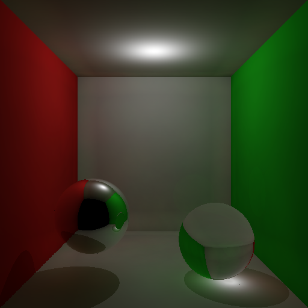

# Photon Mapper
 * Autor: Fernando Peña Bes
 * Autor: José Daniel Subías Sarrato

*Informática Gráfica - Universidad de Zaragoza, curso 2020-21*

## Descripción
Este repositorio contiene un Photon Mapper que permite realizar el renderizado de escenas captando
mediante la emisión de una determinada cantidad de fotones desde las fuentes de lus. Acto seguido
un ray tracer genera rayos desde la cámara para poder realizar la estimación de la radiancia de 
cada pixel. Como punto de partida se toma el código proporcionado por los profesores de la 
asignatura de Informática Gráfica.

En el [informe](doc/photonmapper_report.pdf) se explica en detalle la implementación del programa.

En las siguientes imágenes pueden verse ejemplos de escenas renderizadas con nuestro algoritmo.

|||
|:---:|:---:|

Adicionalmente se implementó la posibilidad de añadir medios participativos(niebla) a las 
escenas.vNo obstante esta funcionalidad no se logró programar a tiempo, por lo que esta 
imcompleta. En las siguientes imágenes pueden verse ejemplos de escenas con presencia de niebla.

|||
|:---:|:---:|

## Cómo compilar

En un entorno Linux deben ejecutarse la siguientes instrucciones para compilar el proyecto:

```
cd Ux
./buildpm.sh
```

## Ejecutar el programa

	./smallpm [opciones ...]

El resultado es una imagen en formato .hdr (Radiance HDR).

### Lista de opciones
El Photon Mapper admite varios argumentos para realizar el renderizado de las escenas.
La goemetría de las mismas ha de ser hardcodeada en el fichero principal del programa. 
Los valores por defecto se muestran entre paréntesis.
	
	-film-name FILE            Nombre del fichero de salida (name_file).

    -film-size-x WIDTH         Anchura de la imagen a renderizar (512).

    -film-size-y HEIGHT        Altura de la iamgen a renderizar (512).

    -scene N                   Especificación de la escena a renderizar debe ser
                               un número entre 1 y 6 (1).

    -pm-total-photons N        Número máximo de fotones a almacenar en cada mapa
                               de fotones: global, cáustico y volumétrico (10000).

    -pm-photons-global N       Número máximo de fotones a almacenar en el mapa
                               de fotones global (10000).

    -pm-photons-caustic N      Número máximo de fotones a almacenar en el mapa 
                               de fotones de cáusticas (10000).

    -pm-photons-volume N       Número máximo de fotones a almacenar en el mapa 
                               de fotones volumétrico (10000).

    -pm-max-photons-shot N     Máximo número de fotones a emitir desde todas 
                               las fuentes de luz en total (100000).

    -pm-nb-nearest-neighbor N  Número de fotones a tener en cuenta para realizar
                               la estimación de la radiancia (10).

    -pm-raytraced-direct       Indica que el cálculo de la luz directa debe ser 
                               realizado mediante trazado de rayos (desactivado).

    -volumetric                Añade un medio participativo al entorno con los valores
                               para los coeficientes de absorción y scattering especificados
                               en el fichero SmallPM/include/ParticipatingMedia.h (desactivado).
